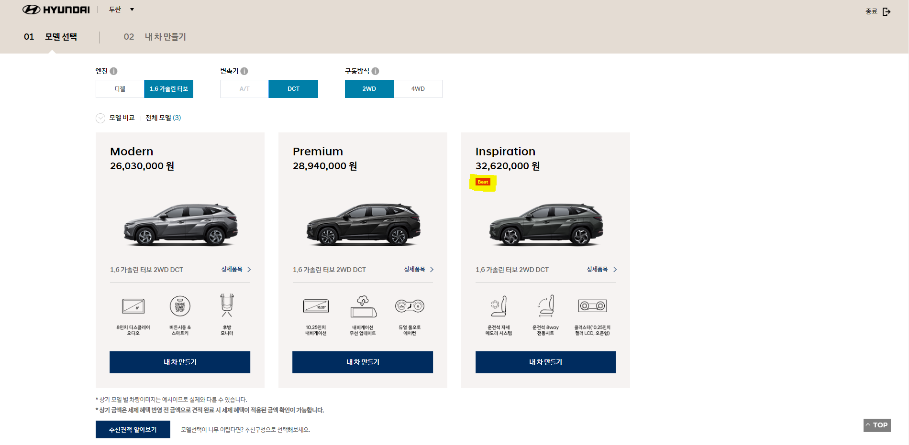
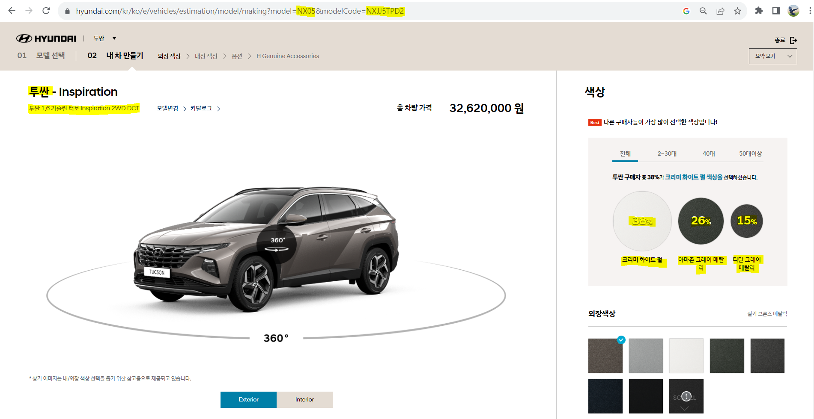

# 현대닷컴 차량 모델의 인기 색상 정보 수집하기

## 순서

1. 인기 사양 정보를 최신화한다. 차량 모델별 인기 사양에는 다음과 같이 best 표시가 되어 있다.

2. Best 버튼을 인식하여 "내 차 만들기" 버튼을 클릭하는 시스템보단, 사전에 best 표시가 있는 인기 사양을 미리 모델별로 파악하여 바로 URL을 타고 접속하는 시스템이 더 시간을 단축한다고 판단하였음.

3. "내 차 만들기" 탭으로 진입하면 URL이 다음과 같은 형식으로 표시된다

https://<hi>www.hyundai.com/kr/ko/e/vehicles/estimation/model/making?model=**NX05**&modelCode=**NXJJ5TPD2**

4. 이 예시의 URL을 살펴보면, model 옆 4자리 코드는 **투싼**이라는 모델을 의미하고, modelCode 옆 9자리 코드는 **투싼 1.6 가솔린 터보 Inspiration 2WD DCT**라는 사양명을 의미한다.

5. 이렇게 모델명과 사양명 정보를 우선적으로 사전에 최신화시켜 "차종-모델 코드.csv" 파일에 저장한 후, 이를 활용하여 색상 비율과 색상명을 수집하는 자동화 프로그램을 실행시켜 데이터를 수집한다.

---

## 기타사항

1. 인기 사양에 대한 정보까지 자동화 프로그램으로 수집하여 더 완벽한 자동화 프로그램을 개발하고 싶었는데 데이터 수집 시간이 너무 소요되어 그러지 못했다는 점이 아쉬웠다.

2. chrome 새 버전이 출시되면서, 기존의 chromedriver로는 selenium이 올바르게 동작하기 않는 현상이 발견되었다. 나의 경우엔 116.0.5845.96의 크롬 버전임을 확인하였으며, 해당 버전의 chromedriver는 [별도의 크롬드라이버 다운로드 링크](https://googlechromelabs.github.io/chrome-for-testing/)에서 다운받을 수 있다. 자신의 크롬에 맞는 버전을 확인하고 다운받으면 된다.
크롬 버전을 확인하려면 크롬 메뉴 도움말 탭의 **Chrome 정보**에서 확인할 수 있다.